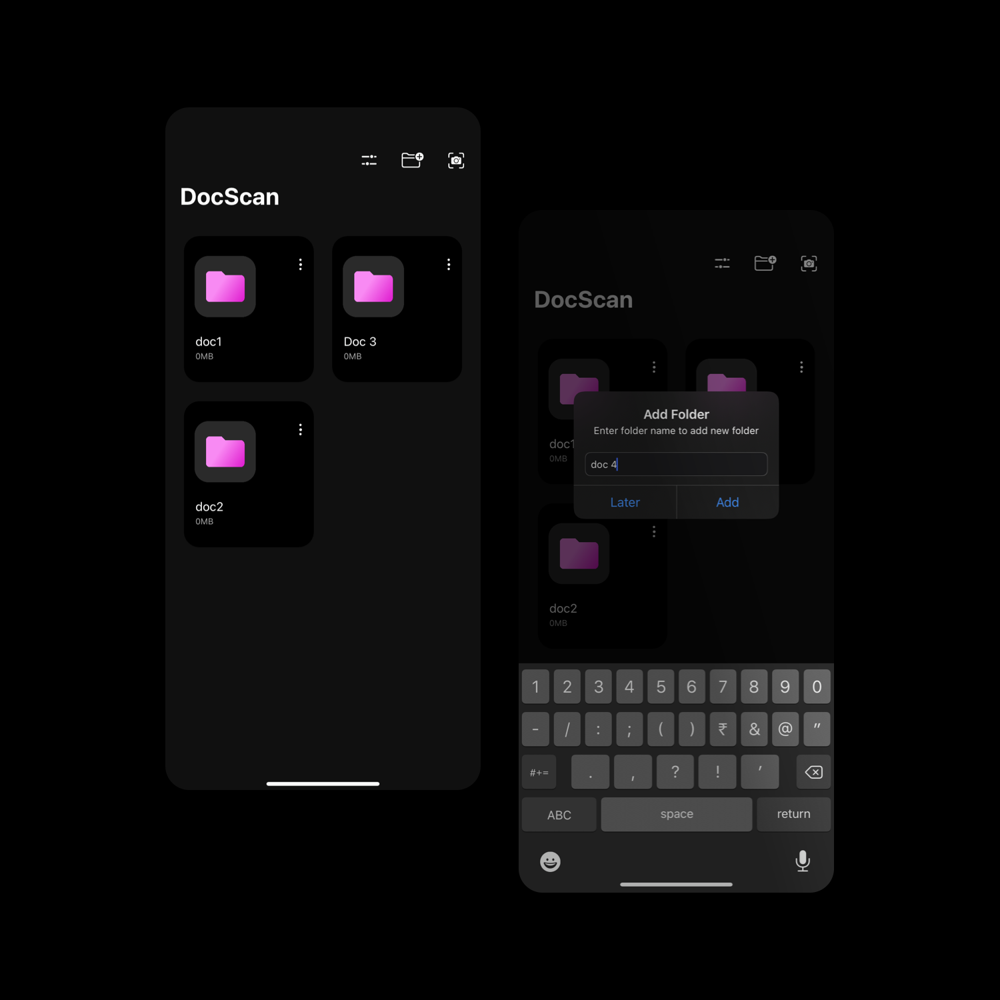

# DocScan - PDFscanner 

Designing and developing a open source pdf scanner from scratch.
DocScan allows to scan and share your PDF documents.

## What you will get in this project

Your following questions are answered in the project:

1. How to create a UIMenu option in xcode.
2. How to create a custom UICollectionView.
3. How to scan images and present them in imageFields.
4. How to get a preview of PDF created.
5. How to share/save the PDF document created to the device.
6. How to add support for multiple app icons in xcode.
7. How to change app theme programatically.

## Getting Started

To get started and run the app, you need to follow these simple steps:

1. Open the DocScan workspace in Xcode.
2. Navigate to your project drectory and run pod install in terminal.

## Compatibility

This project is written in Swift 6.0 for the application part, requires Xcode 12.0 to build and run.

DocScan is compatible with iOS 14.0+.

## Author

* [Ankit Yadav](https://www.instagram.com/thedrunkcoder/)

## License

Copyright 2020 Ankit Yadav.

Licensed under MIT License: https://opensource.org/licenses/MIT

## Note

Install pods after downloading this project to your system and test :)

## Current Status

Added support for PDF Generation for 2 pages only, more pages support features is under development.
